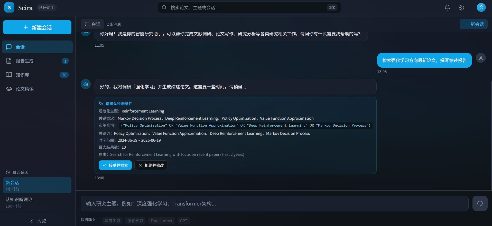
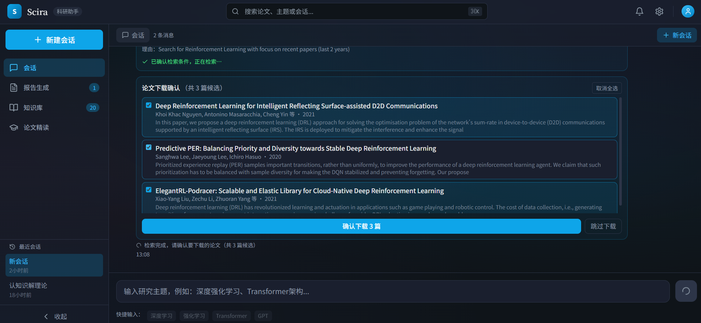
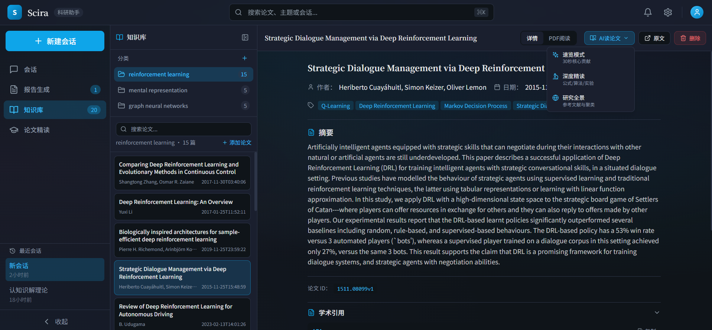
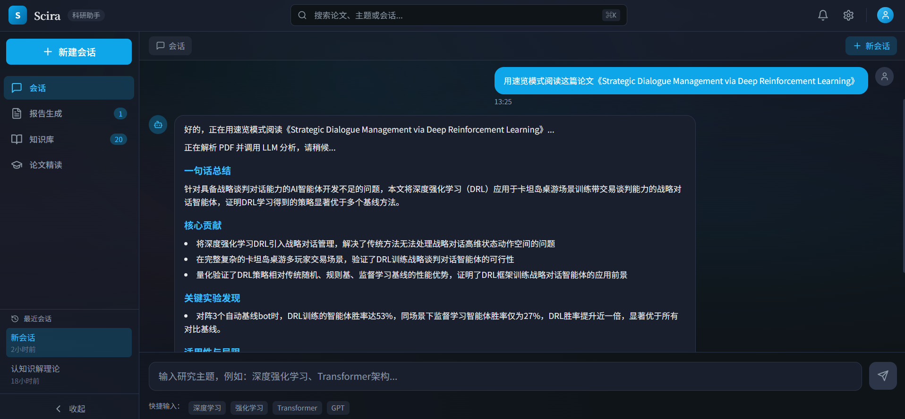
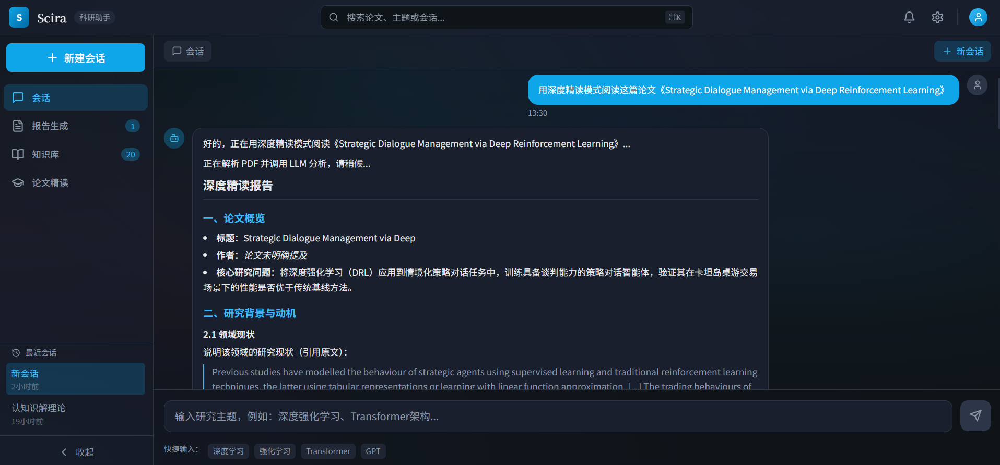
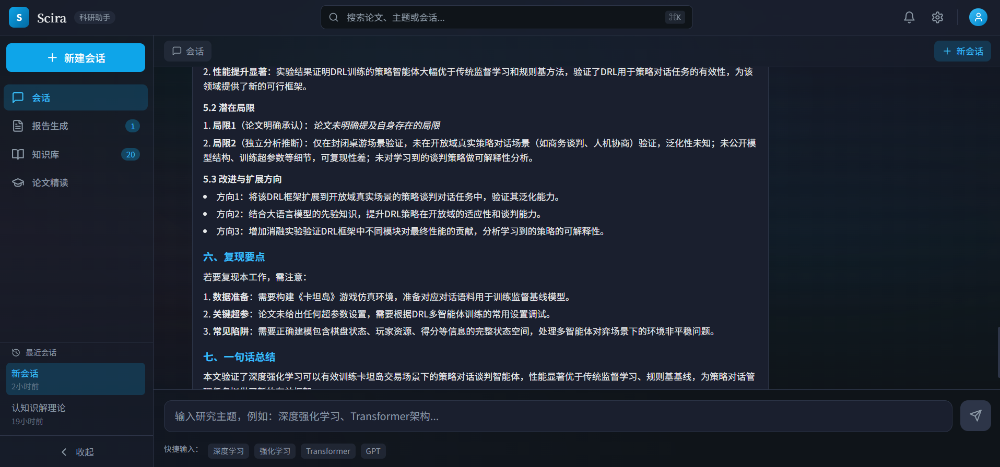
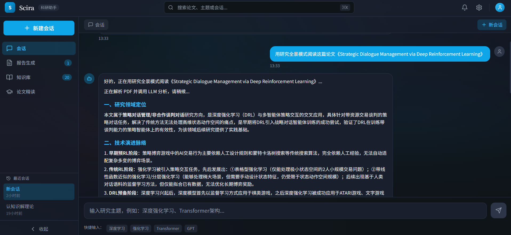
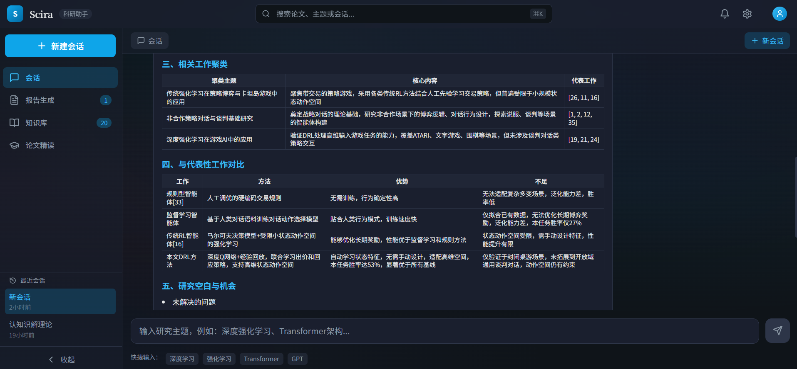
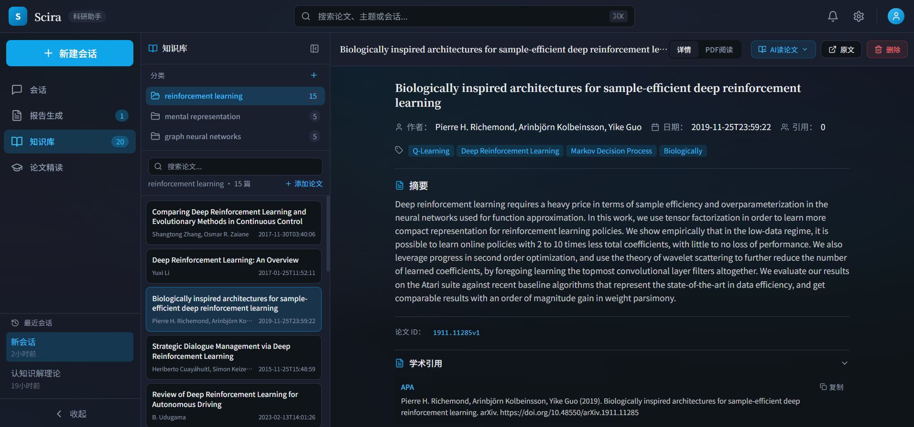

# Scira 🔬 AI 科研助手

基于 LangGraph 的多智能体科研助手，自动完成文献检索、阅读、分析与论文写作。

## ✨ 特性

- **全流程自动化**：输入研究主题 → 自动检索论文 → 阅读分析 → 生成综述报告
- **多智能体协作**：Retrieval → Reader → Analyzer → Writer → Reviewer 分工明确
- **多轮对话**：智能意图识别，问候直回复，知识查询自动检索，仅新研究触发工作流
- **记忆管理**：会话上下文管理，支持上下文压缩与历史搜索
- **MCP 集成**：通过 MCP 协议接入多源学术论文搜索（arXiv、Semantic Scholar、BioRxiv、CORE）
- **人机协同**：关键节点支持人工审核

## 🛠 技术栈

| 类别 | 技术 |
|------|------|
| 框架 | LangGraph、LangChain |
| LLM | OpenAI、Anthropic |
| 前端 | React + TypeScript + Vite + Tailwind |
| 后端 | FastAPI + Python 3.10+ |
| 协议 | MCP (Model Context Protocol) |

## 📂 目录结构

```
scira/
├── src/                          # 源代码
│   ├── main.py                   # 应用入口
│   ├── agents/                   # 智能体
│   │   ├── base.py               # Agent 基类
│   │   ├── orchestrator.py       # 意图分析与任务调度
│   │   ├── retrieval.py          # 论文检索
│   │   ├── reader.py             # 论文阅读
│   │   ├── analyzer.py           # 聚类分析
│   │   ├── writer.py             # 大纲与写作
│   │   ├── reviewer.py           # 修订审核
│   │   └── prompts.py            # 提示词模板
│   ├── core/                     # 核心模块
│   │   ├── state.py              # 状态定义
│   │   ├── workflow.py           # LangGraph 工作流
│   │   ├── memory.py             # 记忆管理
│   │   └── knowledge.py          # 知识库查询
│   ├── mcp/                      # MCP 服务
│   │   ├── server.py             # API 服务入口
│   │   └── paper_search_mcp/     # 论文搜索/下载 MCP
│   │       └── academic_platforms/  # 学术平台集成
│   ├── tools/                    # 工具函数
│   │   ├── pdf_parser.py         # PDF 解析
│   │   └── format_utils.py       # 格式化工具
│   └── utils/                    # 日志等
│       └── logger.py
├── frontend/                      # React 前端
│   └── src/
│       ├── main.tsx              # 前端入口
│       ├── App.tsx               # 主应用组件
│       ├── styles/               # 样式文件
│       └── components/           # 组件
│           ├── ChatView.tsx      # 多轮对话
│           ├── KnowledgeBase.tsx # 知识库
│           ├── DownloadedPapers.tsx
│           ├── GeneratedPapers.tsx
│           ├── Header.tsx        # 顶部导航
│           └── Sidebar.tsx       # 侧边栏
├── data/                         # 数据存储
├── logs/                         # 日志文件
├── config/                       # 配置
├── tests/                        # 测试
├── pyproject.toml                # 项目配置
├── .env                          # 环境变量
└── README.md
```

## 🚀 快速开始

```bash
# 1. 安装依赖
pip install -e .

# 2. 配置环境变量
cp .env.example .env
# 编辑 .env，填入 LLM_PROVIDER=openai, OPENAI_API_KEY=xxx

# 3. 启动服务
python -m src.mcp.server      # 后端 :8001
cd frontend && npm install && npm run dev  # 前端 :5173
```

## 🪟 Windows 一键启动

在 Windows 上双击项目根目录的 `start.bat` 一键部署启动：

- 自动检查 Python 3.10+ 与 Node.js 环境
- 自动创建 `.venv` 虚拟环境并安装后端依赖
- 自动安装前端依赖（`npm install`）
- 首次运行若无 `.env`，自动从 `.env.example` 复制并用记事本打开
- 在两个独立窗口分别启动后端 (:8001) 与前端 (:5173)

**环境要求：**

| 依赖 | 版本 | 说明 |
|------|------|------|
| Python | ≥ 3.10 | 需加入 PATH |
| Node.js | ≥ 16 | 随附 npm |

**使用方式：**

1. 双击 `start.bat`，或命令行执行：
   ```cmd
   start.bat
   ```
2. 首次运行会自动安装依赖，请耐心等待。
3. 看到两个新窗口分别显示后端、前端启动日志即表示成功。
4. 浏览器访问 http://localhost:5173
5. 关闭：直接关闭弹出的"Scira Backend"与"Scira Frontend"窗口。


## 📡 API

| 接口 | 方法 | 说明 |
|------|------|------|
| `/api/chat/send` | POST | 发送聊天消息（多轮对话） |
| `/api/chat/sessions` | GET | 列出会话 |
| `/api/workflow/start` | POST | 启动研究工作流 |
| `/api/workflow/status/{task_id}` | GET | 工作流状态 |
| `/api/paper-search/search` | POST | 搜索论文 |

## 💬 使用

1. 访问 http://localhost:5173
2. 输入研究主题（如"深度学习在医学影像的应用"）
3. 系统自动完成检索→阅读→分析→写作全流程
4. 可在"报告生成"查看结果
### 文献检索


### 文献下载


### 论文阅读


速览模式：

深度精读：


研究全景：



### 报告生成
见[生成的报告](assets/强化学习_20260619_132031.md)


### 知识库管理


---
Powered by [LangGraph](https://langchain-ai.github.io/langgraph/) & [LangChain](https://python.langchain.com/)
